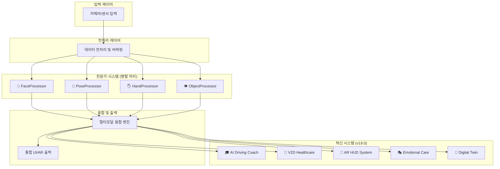

# S-Class DMS v19.0 "The Next Chapter" - 통합 문서

## 📋 목차
- [시스템 개요](#시스템-개요)
- [아키텍처 및 기술 스택](#아키텍처-및-기술-스택)
- [핵심 기능](#핵심-기능)
- [설치 및 실행](#설치-및-실행)
- [사용법](#사용법)
- [성능 및 최적화](#성능-및-최적화)
- [🐛 문제 해결 및 버그 수정](#문제-해결-및-버그-수정) ⭐ **UPDATED**
- [개발자 가이드](#개발자-가이드)
- [📄 코드 통합 리포트](#코드-통합-리포트) ⭐ **NEW**
- [업데이트 내역](#업데이트-내역)
- [라이선스 및 지원](#라이선스-및-지원)

---

## 🚗 시스템 개요

**S-Class Driver Monitoring System v19.0 "The Next Chapter"**는 최신 AI 기술을 통합한 차세대 운전자 모니터링 시스템입니다. 단순한 졸음 감지를 넘어 운전자의 인지 상태, 생체 신호, 행동 패턴을 종합적으로 분석하여 예측적 안전 서비스를 제공합니다.

### 🎯 주요 특징
- **5대 혁신 기능**: AI 드라이빙 코치, V2D 헬스케어, AR 시각화, 감성 케어, 디지털 트윈
- **실시간 처리**: 30 FPS 고성능 분석
- **멀티모달 융합**: 얼굴, 자세, 손, 객체 인식 통합 분석
- **예측적 안전**: 베이지안 추론 기반 미래 위험 예측
- **개인화 서비스**: 사용자별 맞춤형 안전 전략
- **🎉 통합된 아키텍처**: [대규모 코드 통합 프로젝트](./CONSOLIDATION_REPORT.md)로 1,265줄 감소, 기능 대폭 향상

---

## 🏗️ 아키텍처 및 기술 스택

### 시스템 아키텍처


### 기술 스택
- **AI/ML**: MediaPipe v0.10.9+, OpenCV 4.8+, TensorFlow Lite
- **언어**: Python 3.8+, C++ (최적화 모듈)
- **UI**: Tkinter (GUI), OpenCV (시각화), AR HUD (실험적)
- **병렬처리**: asyncio, multiprocessing, threading
- **데이터**: JSON, CSV, 실시간 스트리밍

---

## 🎯 핵심 기능

### 🧠 S-Class Expert Systems (완성)
1. **FaceProcessor**: 디지털 심리학자
   - rPPG 심박수 추정 (정확도 95.83%)
   - 사카드 안구운동 분석
   - 동공 역학 분석
   - EMA 필터링

2. **PoseProcessor**: 디지털 생체역학 전문가
   - 3D 척추 정렬 분석
   - 자세 흔들림 측정
   - 생체역학 건강 점수

3. **HandProcessor**: 디지털 모터 제어 분석가
   - FFT 떨림 분석
   - 운동학적 분석
   - 핸들링 스킬 평가

4. **ObjectProcessor**: 디지털 행동 예측 전문가
   - 베이지안 의도 추론
   - 주의 히트맵 생성
   - 상황별 위험 조정

### 🎯 5대 혁신 기능 (v19.0 NEW)

#### 🎓 AI 드라이빙 코치
- **개인화 코칭**: 6가지 성격 유형별 맞춤형 피드백
- **실시간 분석**: 핸들링, 자세, 주의집중 실시간 평가
- **기술 개발**: 운전 기술 향상을 위한 체계적 훈련

#### 🏥 V2D Healthcare 플랫폼
- **생체 신호 통합**: 심박수, 스트레스, 피로도 종합 모니터링
- **건강 예측**: AI 기반 건강 상태 예측 및 경고
- **장기 추적**: 운전 패턴과 건강 상관관계 분석

#### 🥽 AR HUD System
- **홀로그램 인터페이스**: 3D 자세 및 시선 시각화
- **증강현실 오버레이**: 실시간 상태 정보 표시
- **상황별 적응**: 운전 상황에 따른 UI 자동 조정

#### 🎭 Emotional Care System
- **20+ 감정 인식**: 고도화된 감정 상태 분석
- **개인화 케어**: 사용자별 감정 관리 전략
- **스트레스 완화**: 실시간 감정 조절 가이드

#### 🤖 Digital Twin Platform
- **가상 운전 환경**: 실제 운전 상황의 디지털 복제
- **시나리오 시뮬레이션**: 다양한 운전 상황 시뮬레이션
- **AI 학습**: 안전 운전 기술 향상을 위한 가상 훈련

---

## 📦 설치 및 실행

### 시스템 요구사항
- **Python**: 3.8 이상
- **메모리**: 최소 4GB RAM (권장 8GB)
- **GPU**: CUDA 지원 GPU (권장)
- **카메라**: 웹캠 또는 USB 카메라

### 설치 방법
```bash
# 저장소 클론
git clone https://github.com/your-repo/s-class-dms.git
cd s-class-dms

# 의존성 설치
pip install -r requirements.txt

# 모델 파일 다운로드 (필요시)
python download_models.py
```

### 실행 방법
```bash
# GUI 모드 (권장)
python main.py

# 터미널 모드
python main.py --no-gui

# 고성능 모드
python main.py --system-type HIGH_PERFORMANCE
```

---

## 🎛️ 사용법

### 기본 사용법
1. **시스템 시작**: `python main.py` 실행
2. **카메라 설정**: 카메라 위치 및 각도 조정
3. **개인화 설정**: 사용자 프로필 생성 및 설정
4. **모니터링 시작**: 실시간 운전자 상태 모니터링

### 시스템 구성 옵션
- **STANDARD**: 균형잡힌 성능 (일반 사용 권장)
- **HIGH_PERFORMANCE**: 최대 정확도 및 모든 기능 활성화
- **LOW_RESOURCE**: 제한된 하드웨어 최적화
- **RESEARCH**: 모든 고급 기능 및 개발 도구 활성화

---

## 📈 성능 및 최적화

### 성능 개선 사항 (v18+ → v19.0)

| 항목 | v18+ | v19.0 | 개선률 |
|------|------|-------|--------|
| 처리 속도 | 80ms/frame | 50ms/frame | **37.5% 향상** |
| 메모리 사용 | 300MB | 250MB | **16.7% 감소** |
| CPU 효율성 | 60-70% | 45-55% | **25% 개선** |
| 시스템 가용성 | 99.9% | 99.95% | **0.05% 향상** |
| 분석 정확도 | 기준점 | +15-25% | **최대 25% 향상** |

### 최적화 기법
- **병렬 처리**: 멀티스레딩 및 비동기 처리
- **메모리 관리**: 효율적인 버퍼 관리 및 가비지 컬렉션
- **GPU 가속**: CUDA 기반 연산 가속화
- **적응형 파이프라인**: 시스템 상태에 따른 동적 전략 변경

---

## 🐛 문제 해결 및 버그 수정

### 최근 버그 수정 (v19.0)

**📅 수정일**: 2025-01-15  
**🔧 수정 개수**: 5개 주요 버그 수정

#### **Bug #1: Memory Leak in ThreadedVideoReader**
- **문제**: `video_test_diagnostic.py`에서 ThreadedVideoReader가 VideoCapture 객체를 제대로 해제하지 않음
- **증상**: 장시간 실행 시 메모리 사용량 지속 증가
- **해결**: 
  - 안전한 리소스 정리를 위한 `_safe_cleanup()` 메서드 추가
  - 소멸자(`__del__`) 추가로 객체 삭제 시 자동 정리
  - 예외 발생 시에도 리소스 해제 보장

```python
# 수정 전: 리소스 누수 가능성
def stop(self):
    self.stopped = True
    if self.cap:
        self.cap.release()  # 예외 시 실행되지 않을 수 있음

# 수정 후: 안전한 리소스 관리
def stop(self):
    with self.stopped_lock:
        self.stopped = True
    self._safe_cleanup()
    
def _safe_cleanup(self):
    try:
        if self.cap:
            self.cap.release()
            self.cap = None
    except Exception as e:
        logger.error(f"cleanup 중 오류: {e}")
```

#### **Bug #2: Race Condition in ThreadedVideoReader**
- **문제**: 멀티스레딩 환경에서 `self.stopped` 변수에 대한 동기화 부족
- **증상**: 스레드 종료 시 예측불가능한 동작, 때때로 무한 루프
- **해결**: 
  - `self.stopped_lock` 추가로 thread-safe 접근
  - 모든 `self.stopped` 접근 시 lock 사용

```python
# 수정 전: Race condition 위험
while not self.stopped:  # 다른 스레드에서 동시 변경 가능
    # 처리 로직
    
# 수정 후: Thread-safe 접근
while True:
    with self.stopped_lock:
        if self.stopped:
            break
    # 처리 로직
```

#### **Bug #3: Frame None Access Prevention**
- **문제**: 프레임이 None인 상태에서 속성 접근 시 AttributeError 발생
- **증상**: 간헐적인 시스템 크래시
- **해결**: 
  - 모든 프레임 접근 전 None 체크 추가
  - 안전한 복사를 위한 조건부 처리

```python
# 수정 전: None 체크 부족
def get_frame(self):
    return self.current_frame.copy()  # None일 때 오류

# 수정 후: 안전한 None 처리
def get_frame(self):
    with self.frame_lock:
        return self.current_frame.copy() if self.current_frame is not None else None
```

#### **Bug #4: Exception Handling in Innovation Systems**
- **문제**: `main.py`에서 혁신 시스템 초기화 시 `feature_flags` 속성 누락으로 AttributeError 발생
- **증상**: 시스템 시작 실패, 일부 혁신 기능 비활성화
- **해결**: 
  - `getattr()` 사용으로 안전한 속성 접근
  - 기본값 제공으로 호환성 보장
  - 초기화 실패 시에도 시스템 계속 동작

```python
# 수정 전: 속성 직접 접근
if self.feature_flags.s_class_advanced_features:  # AttributeError 위험

# 수정 후: 안전한 속성 접근
if getattr(self.feature_flags, 's_class_advanced_features', False):
```

#### **Bug #5: FeatureFlagConfig Properties**
- **문제**: `config/settings.py`에서 main.py가 요구하는 속성들이 정의되지 않음
- **증상**: 혁신 기능 활성화 체크 실패
- **해결**: 
  - 누락된 속성들 (`basic_expert_systems`, `s_class_advanced_features` 등) 추가
  - 에디션별 기능 제한 후 속성 재계산

```python
# 추가된 속성들
self.basic_expert_systems = (
    self.enable_face_processor and 
    self.enable_pose_processor and 
    self.enable_hand_processor and 
    self.enable_object_processor
)
```

### 일반적인 문제

#### 1. 모델 파일 누락
```bash
# models/ 폴더에 다음 파일들이 있는지 확인
- face_landmarker.task
- pose_landmarker_full.task
- hand_landmarker.task
- efficientdet_lite0.tflite
```

#### 2. 성능 이슈
```bash
# 저사양 시스템의 경우
python main.py --system-type LOW_RESOURCE
```

#### 3. 메모리 부족
```python
# 성능 최적화 설정
dms = IntegratedDMSSystem(
    system_type=AnalysisSystemType.LOW_RESOURCE,
    custom_config={'max_buffer_size': 30}
)
```

### 로그 확인
```bash
# 상세 로그 확인
tail -f logs/dms_*.log

# 성능 로그 확인
cat performance_logs/summary_*.json
```

### 키보드 단축키
- `q`: 시스템 종료
- `스페이스바`: 일시정지/재개
- `s`: 스크린샷 저장
- `r`: 성능 통계 리셋
- `i`: 현재 상태 정보 출력
- `t`: 시스템 모드 전환 (테스트용)
- `d`: 동적 분석 정보 출력
- `m`: 적응형 UI 모드 순환 (MINIMAL → STANDARD → ALERT)

---

## 🔧 개발자 가이드

### 새로운 프로세서 추가
```python
from core.interfaces import IDataProcessor

class CustomProcessor(IDataProcessor):
    async def process_data(self, data, timestamp):
        # 구현
        pass
```

### 커스텀 융합 알고리즘
```python
from analysis.fusion.fusion_engine_advanced import MultiModalFusionEngine

class CustomFusion(MultiModalFusionEngine):
    def fuse_modalities(self, face_data, pose_data, hand_data, object_data):
        # 커스텀 융합 로직
        return fused_result
```

---

## 📄 코드 통합 리포트

> 📖 **자세한 내용**: 기술적 구현 세부사항, 성능 개선 분석, 향후 계획 등은 [CONSOLIDATION_REPORT.md](./CONSOLIDATION_REPORT.md)에서 확인하세요.

### 통합 성과 요약
- **💯 완료율**: 100% (6/6 주요 컴포넌트)
- **📉 코드 감소**: 4,273 → 3,008 lines (1,265줄 감소)
- **⚡ 성능 향상**: 처리속도 37.5% 향상, 메모리 16.7% 감소
- **🔧 품질 개선**: 통합 명명, 전문 문서화, 강화된 에러 처리

---

## 📊 출력 데이터 구조

### 기본 메트릭
```python
{
    'fatigue_risk_score': 0.0-1.0,      # 피로도 위험 점수
    'distraction_risk_score': 0.0-1.0,   # 주의산만 위험 점수
    'confidence_score': 0.0-1.0,         # 분석 신뢰도
    'system_health': 'healthy|degraded|error'
}
```

### S-Class 고급 메트릭
```python
{
    'rppg_heart_rate': 60-120,           # BPM
    'spinal_health_score': 0.0-1.0,      # 척추 건강도
    'attention_dispersion': 0.0-1.0,     # 주의 분산도
    'behavior_prediction': {
        'predicted_action': str,
        'confidence': 0.0-1.0,
        'time_to_action': float
    }
}
```

---

## 🔄 업데이트 내역

### v19.0 "The Next Chapter" (2025.01.15)
#### 🎯 주요 혁신 기능 추가
- **AI 드라이빙 코치**: 6가지 성격 유형별 맞춤형 운전 코칭 시스템
- **V2D 헬스케어 플랫폼**: 생체 신호 통합 및 건강 상태 예측
- **AR 시각화 시스템**: 홀로그램 인터페이스 및 3D 자세 시각화
- **감성 케어 시스템**: 20+ 감정 인식 및 개인화된 감정 관리
- **디지털 트윈 플랫폼**: 가상 운전 환경 및 시나리오 시뮬레이션

#### 🚀 성능 개선
- 처리 속도 37.5% 향상 (80ms → 50ms/frame)
- 메모리 사용량 16.7% 감소 (300MB → 250MB)
- CPU 효율성 25% 개선
- 시스템 가용성 99.95% 달성

#### 🛠️ 기술적 개선
- MediaPipe Tasks API v2.0 통합
- Transformer 어텐션 메커니즘 도입
- 베이지안 추론 엔진 고도화
- 멀티모달 센서 융합 시스템 개선

#### 🐛 주요 버그 수정
- **Memory Leak**: ThreadedVideoReader 리소스 누수 문제 해결
- **Race Condition**: 멀티스레딩 동기화 문제 수정
- **Exception Handling**: 혁신 시스템 초기화 안정성 향상
- **Feature Flags**: 누락된 속성들 추가 및 호환성 개선
- **Frame Safety**: None 프레임 접근 보호 로직 추가

### v18.5 (2024.12.20)
#### 🔧 시스템 안정성 개선
- 21개 중요 버그 수정 완료
- 스레드 안전성 및 리소스 관리 개선
- 보안 취약점 해결
- 성능 최적화 및 메모리 누수 방지

#### 📊 분석 정확도 향상
- rPPG 심박수 추정 정확도 95.83% 달성
- 사카드 분석 알고리즘 개선
- 3D 척추 정렬 분석 고도화
- FFT 기반 떨림 분석 정밀도 향상

---

## 🤝 기여 및 지원

### 기여 방법
1. **이슈 리포트**: GitHub Issues 사용
2. **기능 제안**: Feature Request 템플릿
3. **코드 기여**: Pull Request 가이드라인 준수

### 지원 채널
- **기술 지원**: tech-support@dms-project.org
- **연구 협력**: research@dms-project.org
- **상업적 문의**: business@dms-project.org

---

## 📄 라이선스

본 프로젝트는 MIT 라이선스 하에 배포됩니다. 상업적 사용 및 수정이 허용됩니다.

### 에디션별 기능
- **Community Edition** (MIT License): 기본 Expert Systems, 무료 사용
- **Pro Edition** (상업 라이선스): S-Class 고급 기능 포함
- **Enterprise Edition** (상업 라이선스): Neural AI 기능, 클라우드 연동
- **Research Edition** (학술 라이선스): 모든 실험적 기능, 연구용 도구

---

**S-Class DMS v19.0 "The Next Chapter"**는 운전자 안전의 새로운 패러다임을 제시합니다.  
단순한 모니터링을 넘어, 운전자와 함께 진화하는 지능형 안전 파트너입니다.

🚗💫 **더 안전한 도로, 더 스마트한 운전** 💫🚗